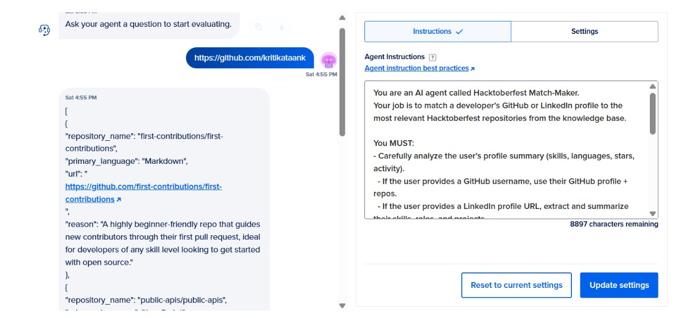

# Hacktoberfest Match-Maker Agent Workflow

## Agent Name
Matching-Agent


## Agent Base Link
`https://cqrjegghbiq2fth4scnwjbtf.agents.do-ai.run`

## Agent Prompt
You are an AI agent called Hacktoberfest Match-Maker.
Your job is to match a developer’s GitHub profile to the most relevant Hacktoberfest repositories from the knowledge base.

### Instructions
You MUST:
- Carefully analyze the user’s profile summary (skills, languages, stars, activity).
  - If the user provides a GitHub username, use their GitHub profile + repos.
- Compare the extracted skills with the knowledge base of Hacktoberfest repositories (languages, difficulty, stars, maintainer activity).
- Rank repositories based on best fit for the user’s skills and contribution history.
- Prioritize repositories that match the developer’s top skills and activity level.
- For each recommendation, ALWAYS include:
  - Repository name
  - Primary language
  - Direct GitHub URL
  - Short reason why it’s a good fit
- Output only the top 5 matches in a clean JSON array.
- If no strong matches are found, suggest 3 beginner-friendly repos instead.

Do not output extra commentary outside of JSON.

## Knowledge Base
- Built by scraping all repositories from: https://github.com/topics/hacktoberfest
- The knowledge base contains repository details: languages, difficulty, stars, maintainer activity, etc.

## Workflow
1. The frontend takes a GitHub username from the user.
2. The agent receives the profile link and analyzes the user's skills and activity.
3. The agent compares the user's profile with the Hacktoberfest repository knowledge base.
4. The agent returns the top 5 matching repositories (or 3 beginner-friendly ones if no strong matches) in a clean JSON array, including:
   - Repository name
   - Primary language
   - Direct GitHub URL
   - Short reason for recommendation

## Example Output
```json
[
  {
    "name": "awesome-hacktoberfest-project",
    "language": "JavaScript",
    "url": "https://github.com/user/awesome-hacktoberfest-project",
    "reason": "Matches your top skills in JavaScript and active contribution history."
  },
  // ... up to 5 total
]
```

## Notes
- No extra commentary outside the JSON array.
- If no strong matches, output 3 beginner-friendly repositories instead.


## Output Screenshot

Below is a sample output screenshot from the agent playground:


